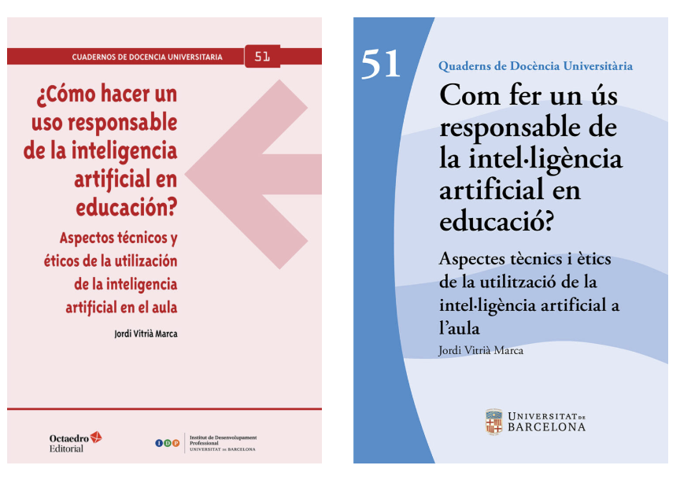

Jordi Vitrià is a Full Professor at the University of Barcelona (UB), which he joined in 2007, and where he teaches an introductory course on **Algorithms for Data Analysis** and advanced courses on **AI Ethics**, **Data Science** and **Deep Learning**. Additionally, he serves as the Director of the [Chair in Artificial Intelligence and Media](https://www.ub.edu/catedres/ca/catedres/catedra-ub-en-intelligencia-artificial-i-mitjans), which is supported by 3Cat.

From April 2011 to January 2016 he served[ as UB'a Head of the Applied Mathematics and Analysis Department. He is now a member of the new Mathematics & Computer Science Department at UB. He is also the director of the [Master in Fundamental Principles of Data Science](https://mat.ub.edu/sciencedata/)) and co-director of the [Data Science and Artificial Intelligence](http://www.ub.edu/datascience/postgraduate/) Postgraduate course at UB.

His research, when personal computers had 128KB of memory, was originally oriented towards digital image analysis and how to extract quantitative information from them, but soon evolved towards computer vision problems. After a postdoctoral year at the University of California at Berkeley in 1993, he focused on Bayesian methods for computer vision methods. Now, he is leading a research group working in deep learning, machine learning and causal inference. He has authored more than 100 peer-reviewed papers and holds several international patents. He has directed 15 PhD theses in the area of machine learning and computer vision. He has been the leader of a large number of research projects at international and national level.

He has been always interested in connecting his academic work to the local technological ecosystem, and since 1993 he has been involved in a large number of projects to transfer academic knowledge to industrial production, medical diagnoses and media applications. He is now director of the [DataScience@UB](https://datascience.ub.edu/tecnio/) group technology transfer group that is supported by the Generalitat de Catalunya (TECNIO Center). During the last years the [DataScience@UB](https://datascience.ub.edu/tecnio/) group has been actively collaborating with companies such as Driving01, DegustaBox, Nestle, CorporateHealth, Eurecat, BBVA, IBM, TUV Rheinland, Telefonica, Vodafone, ICGC, Bodas.net, Given Imaging, correYvuela, Ajuntament de Barcelona, 7ideas, etc. 

## Public service and other activities
+ [Member](https://www.3cat.cat/premsa/3cat-es-dota-dun-comite-dexperts-per-assessorar-se-en-lus-responsable-de-la-intelligencia-artificial/nota-de-premsa/3314593/?ext=SM_TW_F4_CE24_) of the Advisory Committee in Responsible AI of [3Cat](https://www.3cat.cat/3cat/).
+ Director of the [Chair in Artificial Intelligence and Media](https://www.ub.edu/catedres/ca/catedres/catedra-ub-en-intelligencia-artificial-i-mitjans), which is supported by [3Cat](https://www.3cat.cat/3cat/).
+ Member of the [LERU](https://www.leru.org/) team of experts on Responsible AI. The team's missiom is to identify what **responsible AI** means for 24 EU leading universities and map the impact of AI on our institutions. 
+ Member of the Executive Board of the Institute of Marthematics, Universitat de Barcelona.
+ Member of the Advisory Committee for Unique Infrastructures, Ministerio de Ciencia e Innovación, Spain.
+ Member of the Advisory Committee for Next Generation EU Strategy at the Universitat de Barcelona.
+ Member of the Advisory Board, Universitat de Barcelona.

# Highlights

---

**July 2025**:

I’m thrilled to announce “How to Make Responsible Use of Artificial Intelligence in Education” (Octaedro Publishing) (In Catalan and Spanish). This practical guide is designed to help teachers, school leaders, and content creators integrate AI into the classroom in an ethical, safe, and thoughtful way.

🔍 What’s inside?
+ Core principles of predictive and generative AI tailored to educational settings
+ Risks, opportunities, and best practices for protecting students and their privacy
+ A responsible-use checklist and real-world examples from schools already working with AI
+ Strategies to foster critical thinking and digital competence

📖 The book is available open access to maximize its reach and impact.

👉 Download it here: 
+ Catalan: https://octaedro.com/libro/com-fer-un-us-responsable-de-la-intel%c2%b7ligencia-artificial-en-educacio/
+ Spànish: https://octaedro.com/libro/como-hacer-un-uso-responsable-de-la-inteligencia-artificial-en-educacion/

The key isn’t to ban AI, but to learn how to use it wisely. I invite the entire education community to read, share, and—most importantly—discuss how we can turn AI into a responsible ally for better learning outcomes.
Special thanks to Octaedro Editorial and everyone who contributed their ideas and experiences during the writing process.
If you read it, I’d love to hear your feedback! 

**May 2025**:

+ R. Pros and J. Vitrià,["Preventing Spurious Interactions: A New Inductive Bias for Accurate Treatment Effect Estimation,"](https://ieeexplore.ieee.org/document/11016676) in IEEE Access, doi: 10.1109/ACCESS.2025.3574547.
+ The [UB Chair in Artificial Intelligence and Media](https://www.ub.edu/catedres/ca/catedres/catedra-ub-en-intelligencia-artificial-i-mitjans) publishes the document "**Generation and Dissemination of Synthetic Media in Public Audiovisual Communication**", a proposal of guidelines for the responsible use of artificial intelligence in the audiovisual field. This report, prepared by Mònica Navarro-Michel, Oriol Pujol, Carlos Lopezosa, and Jordi Vitrià, addresses the growing challenges posed by the generation of synthetic images, audio, and video in the context of media and especially in the public sphere. The document offers a set of specific recommendations to ensure transparency, editorial responsibility, and the protection of fundamental rights in the use of these technologies. The proposal is based on a commitment to public service values and includes aspects such as: - The obligation to label synthetic content. - Avoiding risks such as misinformation, manipulation, or privacy violations. - Establishing a responsible AI committee and quality protocols. - Staff training and continuous updating of guidelines. - Promoting a culture of transparency and internal collaboration. This document becomes a key tool for the debate on the future of AI-generated content in public media, in line with the new European Regulation on Artificial Intelligence (RIA). Check out the full [document](https://hdl.handle.net/2445/221259) (in Catalan).
  

**April 2025**:

+ P.Gómez, A.Brando, and J.Vitrià. 2025. **Solving the Contextual Pure Cold-Start Problem under Uncertainty**. ACM Trans. Recomm. Syst. Just Accepted (April 2025). https://doi.org/10.1145/3729245
**January 2025**:

+ [DataScienceUB](https://datascience.ub.edu/research/), in collaboration with [Nextus](https://nextus.global/en), is pleased to announce the launch of an innovative Generative AI project (Nuclis 2024, Generalitat de Catalunya) aimed at revolutionizing the use of multimedia in education. This project focuses on using pre-trained foundational models to significantly improve the ability to analyze and interpret visual content. Large predictive models based on generative AI have notably advanced computer vision, a field that has evolved from simple pattern recognition to sophisticated systems capable of complexly analyzing the visual elements of a video. The project will focus on several key areas to improve educational outcomes:
    +  **Automatic Transcription and Indexing**: By transcribing audio from educational documentaries and indexing the content, educators can easily search and access specific information, making it more convenient to integrate multimedia resources into their teaching.
    +  **Visual Element Detection and Indexing**: The project will detect and index visual elements such as scenes, people, and actions within educational videos. This will enable educators to quickly find relevant visual content to support their lessons.
    + **Clip Selection**: The AI will automatically select short clips from long-duration videos based on predefined themes of interest. This feature will help educators create focused and engaging lesson materials without spending hours sifting through video content.
    + **Description and Summarization**: The selected clips will be described and summarized, providing educators with concise overviews that can be used to introduce topics or reinforce learning objectives.
    + **Support for Educational Material Creation**: The project will assist experts in generating educational materials related to the selected clips. This includes creating quizzes, discussion questions, and supplementary resources that align with the visual content.

+ Pros, R., Vitrià, J. (2025). [Exploiting Causal Knowledge During CATE Estimation Using Tree Based Metalearners](https://link.springer.com/chapter/10.1007/978-3-031-74640-6_19). In: Meo, R., Silvestri, F. (eds) Machine Learning and Principles and Practice of Knowledge Discovery in Databases. ECML PKDD 2023. Communications in Computer and Information Science, vol 2136. Springer, Cham. https://doi.org/10.1007/978-3-031-74640-6_19

**October 2024**:

+ Alexandre Trilla*, Ossee Yiboe, Nenad Mijatovic (Alstom), Jordi Vitria (Universitat de Barcelona). [Industrial-Grade Smart Troubleshooting through Causal Technical Language Processing: a Proof of Concept](https://arxiv.org/pdf/2407.20700), 2nd Workshop on Causal Inference and Machine Learning in Practice, KDD 2024.
+ Arturo Fredes, Jordi Vitrià. [Using LLMs for Explaining Sets of Counterfactual Examples to Final Users](https://arxiv.org/pdf/2408.15133?). 2nd Workshop on Causal Inference and Machine Learning in Practice, KDD 2024.
+ Jordi Vitrià, [¿Cómo pueden las máquinas tener en cuenta las consecuencias de sus acciones?](https://theconversation.com/como-pueden-las-maquinas-tener-en-cuenta-las-consecuencias-de-sus-acciones-239103), The Conversation, 2024.
+ Jordi Vitrià, [Los Nobel de este año: qué tiene que ver la física con la inteligencia artificial](https://theconversation.com/los-nobel-de-este-ano-que-tiene-que-ver-la-fisica-con-la-inteligencia-artificial-240932), The Conversation, 2024.

**June 2024**:

+ Director of the [Chair in Artificial Intelligence and Media](https://www.ub.edu/catedres/ca/catedres/catedra-ub-en-intelligencia-artificial-i-mitjans), which is supported by 3Cat.
+ Busy organizing the <u><a href="https://kdd2024.kdd.org/call-for-undergraduate-consortium/">Undergraduate Consortium at KDD 2024</a></u>.
+ Accepted paper:  <u><a href="https://arxiv.org/abs/2407.11056"> Industrial-Grade Time-Dependent Counterfactual Root Cause Analysis through the Unanticipated Point of Incipient Failure: a Proof of Concept </a></u>, by Alexandre Trilla, Rajesh Rajendran, Ossee Yiboe, Quentin Possamaï, Nenad Mijatovic & Jordi Vitria, at Workshop on Causal Inference for Time Series Data at UAI, 2024.
+ Accepted paper: <u><a href="https://openreview.net/pdf?id=Nx7YoLkLW9"> Preventing spurious interactions in tree-based metalearners</a></u>, by Roger Pros and Jordi Vitrià, 9th Causal Inference Workshop at UAI, 2024.
+ Accepted paper: <u><a href="https://doi.org/10.3390/rs16122153">Effective Training and Inference Strategies for Point Classification in LiDAR Scenes</a></u>, Mariona Carós, Ariadna Just, Santi Seguí and Jordi Vitrià. **Remote Sensing** 2024, 16, 2153.
+  Pros, R., & Vitrià, J. (2024). <u><a href="https://arxiv.org/pdf/2404.12238"> Neural Networks with Causal Graph Constraints: A New Approach for Treatment Effects Estimation</a></u>. arXiv preprint arXiv:2404.12238.

**February 2024**:

+ Paula G. Duran, Pere Gilabert, Santi Seguí, and Jordi Vitrià. 2024. **Overcoming Diverse Undesired Effects in Recommender Systems: A Deontological Approach**. ACM Trans. Intell. Syst. Technol. Just Accepted (February 2024). https://doi.org/10.1145/3643857

**October 2023**:
+ Pros, R., Vitrià, J. **Exploiting causal knowledge during CATE estimation using tree based metalearners**. ECML/PKDD’23
Workshop on Uplift Modeling and Causal Machine Learning for Operational Decision Making, 2023.
+ Vitrià, Jordi, Oriol Pujol, and Pilar Dellunde. <u><a href="https://revistas.um.es/daimon/article/view/562811/346711)"> **Cerrando una brecha: una reflexión multidisciplinar sobre la discriminación algorítmica | Bridging a gap: A multidisciplinary reflection on algorithmic discrimination.** </a></u> Daimon Revista Internacional de Filosofia 90 (2023): 63-80.
+ Laiz, P., Vitrià, J., Gilabert, P., Wenzek, H., Malagelada, C., Watson, A. J., & Seguí, S. (2023). <u><a href="https://www.sciencedirect.com/science/article/pii/S0895611123000617/"> **Anatomical landmarks localization for capsule endoscopy studies**. </a></u> Computerized Medical Imaging and Graphics, 108, 102243.
+ Carós, Mariona, et al. <u><a href="https://ieeexplore.ieee.org/document/10216191/"> **Self-Supervised Pre-Training Boosts Semantic Scene Segmentation on LiDAR data.** </a></u>  2023 18th International Conference on Machine Vision and Applications (MVA). IEEE, 2023.
+ P Gilabert, C Malagelada, H Wenzek, J Vitrià, S Seguí, <u><a href="https://ieeexplore.ieee.org/abstract/document/10215919/"> **Leveraging Embedding Information to Create Video Capsule Endoscopy Datasets** </a></u>, 18th International Conference on Machine Vision and Applications (MVA). IEEE, 2023.
+ Gilabert, P., Vitrià, J., Laiz, P., Malagelada, C., Watson, A., Wenzek, H., & Segui, S. (2022). **Artificial intelligence to improve polyp detection and screening time in colon capsule endoscopy**. Frontiers in Medicine, 9, 1000726.

**June 2023**:
+ Arnau Quindós, Pablo Laiz, Jordi Vitrià, Santi Seguí, Self-supervised out-of-distribution detection in wireless capsule endoscopy images,
Artificial Intelligence in Medicine, 2023, 102606, ISSN 0933-3657, https://doi.org/10.1016/j.artmed.2023.102606

**May 2023**: Invited Talk: **AI is broken**. Club Business Innovation & Technologies Esade Alumni.

**May 2023**: Invited Talk: **El rol de la IA en la nueva medicina**, Jornadas para Alta Dirección en Salud, San Telmo Business School, Sevilla. Organizado por Bioinformatics BCN, San Telmo Business School y Junta de Andaluacía.

**April 2023**: Tutorial: **An introduction to Causal Inference for ML practitioners**. Openbank, Madrid.

**December 2022**: Keynote Speaker at the 2022 <u><a href="https://www.ai4es.com/">AI4ES</a></u> Summit. Topic: **Causal Artificial Intelligence**. <u><a href="https://www.youtube.com/watch?v=gdCE59IKiyA&t=1s">Video</a></u> (in Spanish). 

**November 2022**: 
+ Curso de Big Data e Inteligencia Artificial para gestores de salud, 18 de Noviembre, 2022, 
Santiago de Compostela. Salón de Actos de la Consellería de Sanidade. Organizado por Bioinformatics BCN.
+ Curso semipresencial sobre las nuevas tecnologías bioinformáticas y de análisis de datos masivos en el ámbito biomédico: Big Data &
Inteligencia Artificial para gestores de la Salud". Madrid.  Hospital Universitario Ramón y Cajal. 11 de noviembre, 2022. Organizado por Bioinformatics BCN.

**October 2022**: Jornadas formativas sobre las nuevas tecnologías bioinformáticas y de análisis de datos masivos en el ámbito biomédico. Las Palmas de Gran Canaria
Hospital Doctor Negrín.  17 de octubre, 2022. Organizado por Bioinformatics BCN.

**September 2022**: Invited Talk: **Causality without Estimands: Application to Black-Box Explainability**. September 26, 2022, Umea University, Sweden.

**July 2022** - Accepted papers-
+ García, C., Mora, O., Pérez-Aragüés, F. et al. CatLC: Catalonia Multiresolution Land Cover Dataset. Sci Data 9, 554 (2022). https://doi.org/10.1038/s41597-022-01674-y
+ Á. Parafita and J. Vitrià, <u><a href="https://ieeexplore.ieee.org/document/9815055"> Estimand-Agnostic Causal Query Estimation with Deep Causal Graphs,</a></u> in IEEE Access, 2022, doi: 10.1109/ACCESS.2022.3188395.

**May 2022** - Accepted papers-

+ Brando, Axel, et al. <u><a href="https://proceedings.mlr.press/v151/brando22a.html"> Deep Non-Crossing Quantiles through the Partial Derivative</a></u>. International Conference on Artificial Intelligence and Statistics. PMLR, 2022.
+ Pascual, Guillem, et al. <u><a href="https://authors.elsevier.com/c/1f8F62OYd01i7"> Time-based Self-supervised Learning for Wireless Capsule Endoscopy.</a></u> Computers in Biology and Medicine, Volume 146, 2022.

**July 2021** - We are part of one of the 38 winning projects of the [Artificial Intelligence in Health & Care NHS Award](https://www.gov.uk/government/news/36-million-boost-for-ai-technologies-to-revolutionise-nhs-care): Detecting bowel cancer – using AI to analyse video recordings of the gastrointestinal tract, taken from a swallowable camera, to target bowel cancer and other gastrointestinal diseases.

**September 2020** - An [app](https://rb.gy/5mkfbj) developed by [@ICGCat](https://www.icgc.cat/) that combines satellite data, big data, and artificial intelligence in order to monitor the use of water resources has won the top prize at this year’s European Space Agency [@esa](https://www.esa.int/) Space App Camp.  This work is part of a successful industrial doctorate collaboration between @ICGCat and @datascienceUB @UniBarcelona @MatesInfoUB about the use of advanced deep learning methods for analyzing satellite data. 

<iframe src="https://rb.gy/5mkfbj" width="800" height="360" frameborder="1" webkitallowfullscreen mozallowfullscreen allowfullscreen></iframe>

In the news: 

+ [Telenoticies TV3](https://www.ccma.cat/tv3/alacarta/telenoticies/telenoticies-vespre-15102020/video/6064402/) (in Catalan, min. 45)
+ [Sostenible](https://www.sostenible.cat/noticia/linstitut-cartografic-i-geologic-i-la-ub-premiats-per-un-projecte-sobre-la-sobreexplotacio)(Diputació de Barcelona)
+ [La Vanguardia](https://www.lavanguardia.com/vida/20200929/483759482305/icgc-y-ub-premiados-por-un-proyecto-sobre-la-sobreexplotacion-de-acuiferos.html)
+ [El Punt/Avui](https://www.elpuntavui.cat/territori/article/11-mediambient/1862925-l-any-hidrologic-es-tanca-amb-un-30-mes-de-pluja.html)
+ [Newsbreak](https://www.newsbreak.com/news/2066379744261/quifer-app-grabs-top-prize-at-2020-space-app-camp)
+ [soziokulturfuturist](https://soziokulturfuturist.wordpress.com/2020/09/21/quifer-app-grabs-top-prize-at-2020-space-app-camp/)
+ [AZO Space iof Innovation](https://space-of-innovation.com/quifer-app-wins-double-at-first-virtual-esa-space-app-camp/)
+ .

---

**July 2019** - Master in Foundations of Data Science

<iframe src="https://player.vimeo.com/video/329128171" width="640" height="360" frameborder="0" webkitallowfullscreen mozallowfullscreen allowfullscreen></iframe>

---

**Feb. 2019** - Our project on artificial intelligence enables the improvement of [colorectal cancer screening](http://www.fbg.ub.edu/en/news/project-artificial-intelligence-enables-the-improvement-of-colorectal-cancer-screening/). 

<iframe src="https://player.vimeo.com/video/311499465" width="640" height="360" frameborder="0" webkitallowfullscreen mozallowfullscreen allowfullscreen></iframe>

<a href="https://vimeo.com/311499465">[DataScience] Endoscopy</a> from <a href="https://vimeo.com/giny">Giny Comunicaci&oacute;</a> on <a href="https://vimeo.com">Vimeo</a>.

---

## Contact

Departament de Matemàtiques i Informàtica  
Facultat de Matemàtiques i Informàtica   
Universitat de Barcelona  
Gran Via 585, 08007 Barcelona  
email: jordi.vitria at ub.edu  
tweeter: [@bitenmascarado](https://twitter.com/bitenmascarado)  
